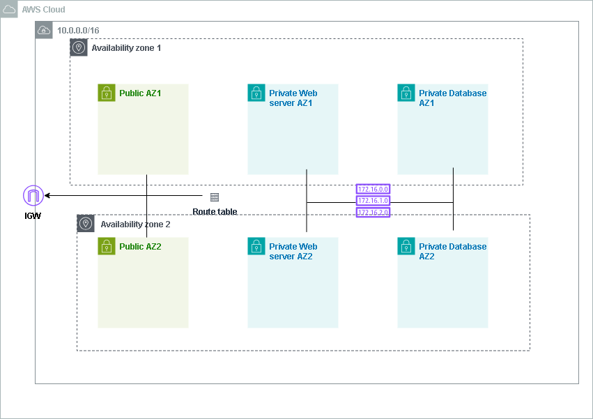
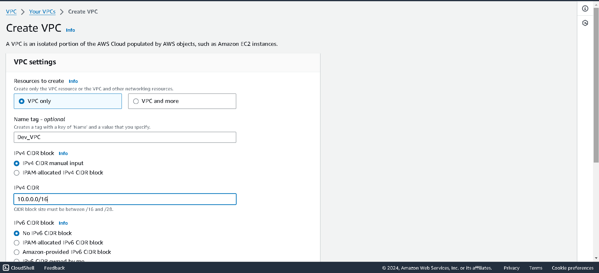
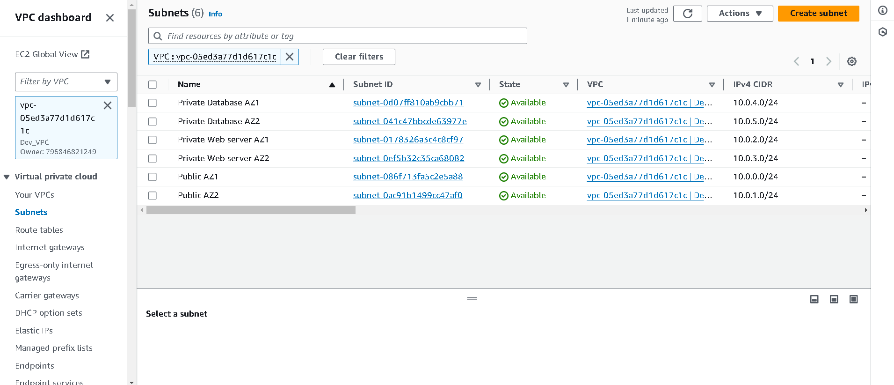
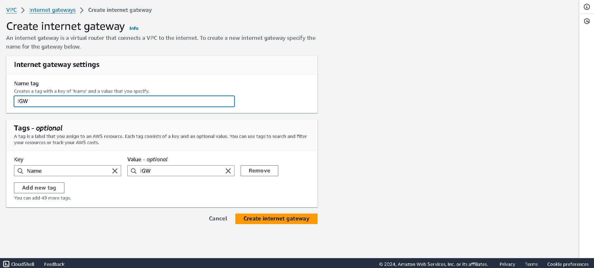
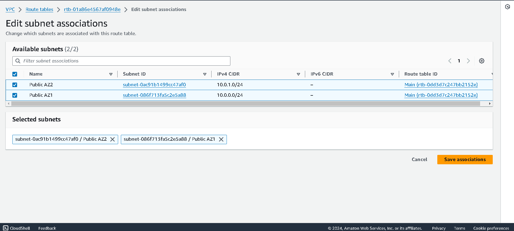
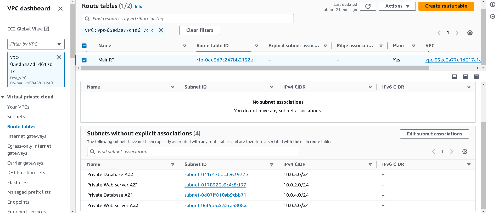

# VirtualPrivateCloud (VPC)
VPC is a logically isolated portion of the AWS cloud into which you can deploy your resources.

# AWS VPC Project

## Overview

## Architecture Diagram



This project involves the creation of a Virtual Private Cloud (VPC) using AWS to ensure a secure, scalable, and highly available infrastructure. The VPC includes multiple subnets, route tables, and an internet gateway to facilitate communication between instances and the internet.

## Tools Used
- AWS VPC

## Project Details

### Custom VPC Creation
- Created a custom VPC with both public and private subnets spread across two availability zones (AZs) to ensure high availability and fault tolerance.

### Internet Gateway
- An Internet Gateway (IGW) was created to enable communication between instances within the VPC and the internet.

### Availability Zones
- Utilized two availability zones to distribute resources and improve the infrastructure's fault tolerance.

### Subnets
- **Public Subnets**:
  - Created two public subnets for resources that need direct access to the internet, such as NAT Gateways, Bastion Hosts, and Application Load Balancers.
- **Private Subnets**:
  - Created four private subnets to securely host databases and web servers, ensuring they are not directly accessible from the internet.

### Route Tables
- **Public Route Table**:
  - Created a public route table that routes internet traffic through the Internet Gateway.
- **Private Route Table**:
  - The main route table associated with the private subnets ensures that internal traffic is properly routed without exposing the resources to the internet.

## Steps to Recreate the VPC

1. **Create a Custom VPC**:
    ```bash
    aws ec2 create-vpc --cidr-block 10.0.0.0/16
    ```
    

2. **Create Subnets**:
    ```bash
    # Public Subnets
    aws ec2 create-subnet --vpc-id <vpc-id> --cidr-block 10.0.1.0/24 --availability-zone <az1>
    aws ec2 create-subnet --vpc-id <vpc-id> --cidr-block 10.0.2.0/24 --availability-zone <az2>
    
    # Private Subnets
    aws ec2 create-subnet --vpc-id <vpc-id> --cidr-block 10.0.3.0/24 --availability-zone <az1>
    aws ec2 create-subnet --vpc-id <vpc-id> --cidr-block 10.0.4.0/24 --availability-zone <az2>
    aws ec2 create-subnet --vpc-id <vpc-id> --cidr-block 10.0.5.0/24 --availability-zone <az1>
    aws ec2 create-subnet --vpc-id <vpc-id> --cidr-block 10.0.6.0/24 --availability-zone <az2>
    ```
    

3. **Create an Internet Gateway**:
    ```bash
    aws ec2 create-internet-gateway
    aws ec2 attach-internet-gateway --vpc-id <vpc-id> --internet-gateway-id <igw-id>
    ```
    

4. **Create Route Tables**:
    ```bash
    # Public Route Table
    aws ec2 create-route-table --vpc-id <vpc-id>
    aws ec2 create-route --route-table-id <public-route-table-id> --destination-cidr-block 0.0.0.0/0 --gateway-id <igw-id>
    
    # Associate public subnets with the public route table
    aws ec2 associate-route-table --subnet-id <public-subnet-id1> --route-table-id <public-route-table-id>
    aws ec2 associate-route-table --subnet-id <public-subnet-id2> --route-table-id <public-route-table-id>
    ```
    
    
    
    # Main Route Table (Private)
   ```bash
    aws ec2 associate-route-table --subnet-id <private-subnet-id1> --route-table-id <main-route-table-id>
    aws ec2 associate-route-table --subnet-id <private-subnet-id2> --route-table-id <main-route-table-id>
    aws ec2 associate-route-table --subnet-id <private-subnet-id3> --route-table-id <main-route-table-id>
    aws ec2 associate-route-table --subnet-id <private-subnet-id4> --route-table-id <main-route-table-id>
    ```
    


## Conclusion
This project demonstrates the creation of a highly available and fault-tolerant VPC using AWS services. By following the steps outlined above, you can recreate this environment to suit your infrastructure needs.

